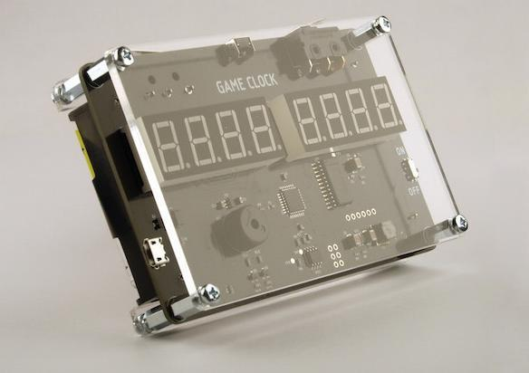
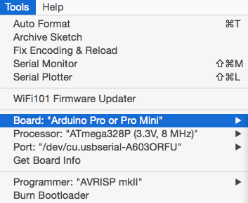
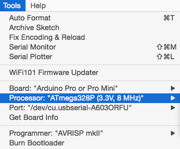

---
title:  'Game Clock'
...

# Game Clock

High quality and accurate timekeeping device that can also be reprogrammed.

## Overview

Keep track of play time such as during a game of chess.
All the components in place for you to upload your own software using the Arduino IDE.

# Hardware

## Power

There are several options:

2 x AA alkaline or rechargeable batteries (recommended for portable use)
USB (for continuous usage)
Serial Port / ISP Header (during programming, debugging, etc.)

## Microcontroller

At the heart of the game clock is the ATmega328PB microcontroller.

This is the new and updated version of the classic microcontroller that you may find on the Arduino boards.

Running at 8MHz and 3.3 volts.

## Buttons

High quality and durable buttons.

Left and right micro switches and central push button.

## Display

8-Digit LED Display controlled by a MAX7219CWG IC.

Brightness controlled by software.

## Audio

Passive buzzer capable of playing tones of varying frequencies.

## Wireless Communications

20-pin connector for XBee module for wireless communication and control.

## Real-time clock

Extremely accurate timekeeping using a DS3231M IC.

# Software

## Arduino compatibility

The built-in board definition for the "Arduino Pro or Pro Mini" in the Arduino 1.8 IDE is all you need to start programming the Game Clock with your own software.

Select "Tools" in the menu and select "Board" :

Choose the "Arduino Pro or Pro Mini" board:

Select "Tools" from the menu and then "Processor":

Choose "ATmega328P (3.3V, 8MHz)":

## Serial Port Programming

A USB to serial board is required (not included) to upload software from the Arduino IDE to the Game Clock using the 6-pin connector located at the back of the device.

The SparkFun FTDI Basic Breakout is highly recommended due to the low hassle factor.

Select "Tools" and then "Port":

Select your serial port (yours will have a different identifier):

# Pins

| Input            | Pin           
|:----------------:|:-------------:
| Button 1 (RIGHT) | 3
| Button 2 (LEFT)  | 2
| button 3 (MIDDLE)| 4

| Output              | Pin(s)           
|:-------------------:|:-----------------:
| Passive Buzzer      | 6
| XBee enable/disable | 7
| Display             | 13,12,11,10 (SPI)
| RTC                 | A4, A5 (i2c)

# Resources

Link to ino file

Link to hex file

Link to PDF instructions

[ATmega328PB datasheet](https://www.microchip.com/wwwproducts/en/ATmega328PB)

